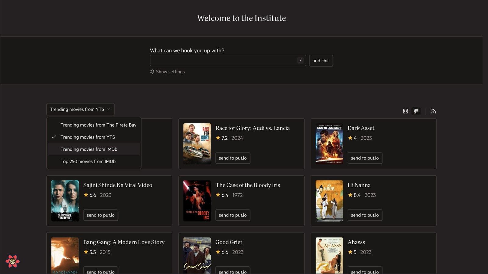
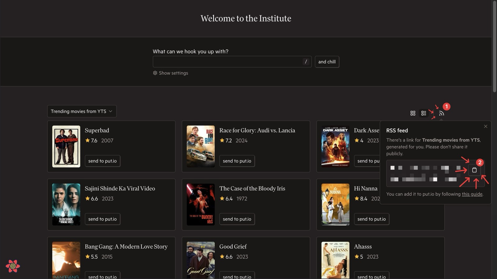
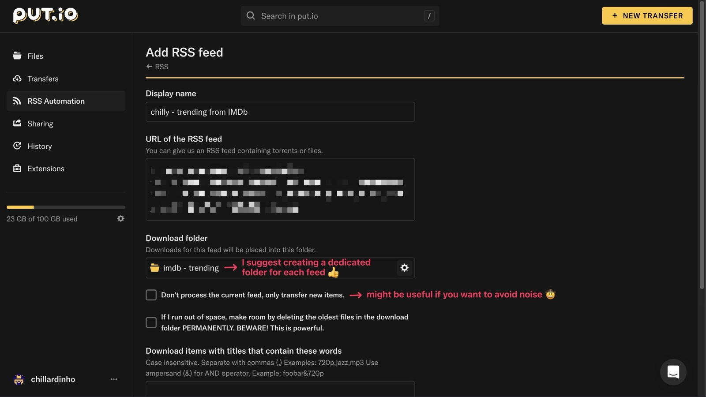
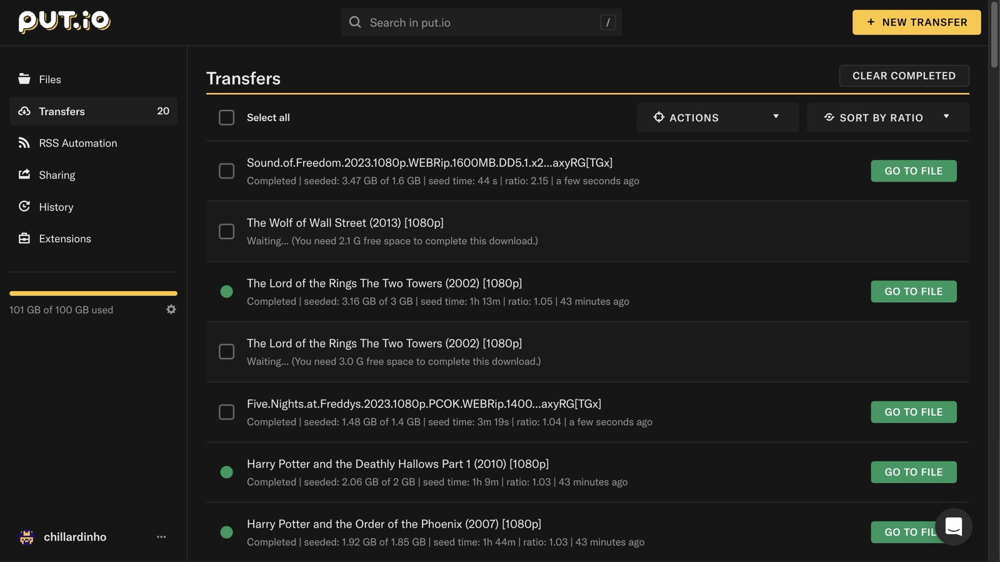
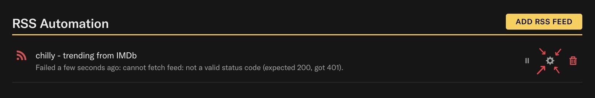

# Guides

## Add a top-movies RSS feed to put.io

Want a little more institutional power? Here you go.

1. Pick a top-movies source on the home page.

2. Click the RSS icon next to the source selector and copy the generated feed URL.

3. Open [put.io/rss/new](https://app.put.io/rss/new) and add it as a new RSS feed.

4. Enjoy.

### A small warning

RSS feed URLs include a token tied to your session, so keep them private.

If you revoke the token, sign out, or I break something on my side, the old URL may stop working. If that happens, sign out and sign back in to `chill.institute`, then replace the feed URL in put.io with a freshly generated one.

## Reporting a crash

1. If the crash fallback appears, add a short note about what you were doing.
2. Click `Copy report` if you want to paste the details manually.
3. Click `Create GitHub issue` if you want a prefilled bug report in the public repo.
